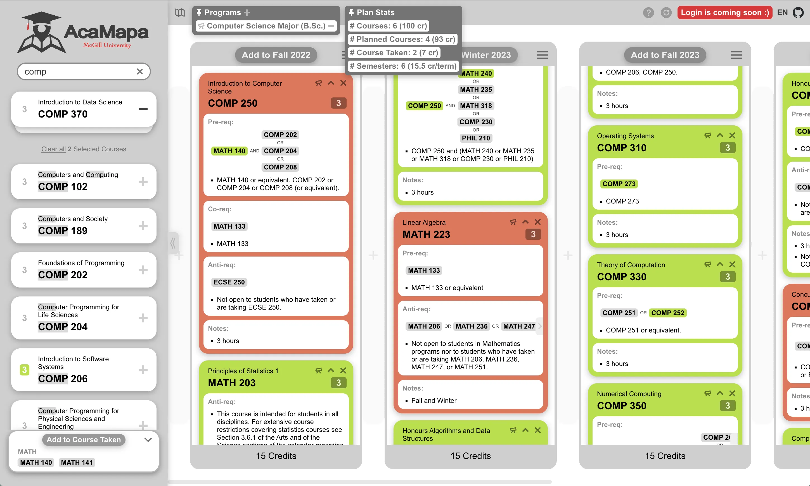

# AcaMapa  
_A Web App that helps McGill students plan their degree_

<p align="center">
  
  
  
  
  
</p>

> a HUGE THANK to [@EvEnzyme](https://github.com/EvEnzyme) for ideation, UI/UX design, writups and mental supports :)

---


## 📌 Motivation  
As a McGill student, I often find it frustrating to plan my degree:  
- I had to jump between different webpages (course descriptions, program requirements) and keep my own notes in Google Docs or text files, which I would eventually lose the following year.  
- It was hard to figure out which electives I could take based on the courses I had already completed.  
- Finding courses and programs that actually matched my interests was even harder.  
- Existing tools like **myProgress** and **VSB** serve different purposes, but neither made long-term planning easy.  

**AcaMapa** addresses these issues by crawling and parsing program/course information and offering a **visual, drag-and-drop planning experience** that’s both simple and flexible.  

---

## 🎥 Demo  
(Youtube Video, GIFs comming soon)  


---

## ✨ Features  

1. **Find & pin your program(s)**  
   - Add required and complementary courses directly from the parsed results.  

2. **Plan your degree semester by semester**  
   - Reorder and organize terms and courses with simple drag-and-drop.  
   - Add extra or missing courses into terms through search.  
   - Explore future electives directly from course cards and dive deeper into areas of interest.  

3. **Validate your plan with requirement checks**  
   - Courses are shown in <strong><span style="color:#b2e026">green</span></strong> if all requirements are satisfied and <strong><span style="color:#ed7155">red</span></strong> if not. 
   - Requirements are validated against pre-, co-, and anti-requisites.  
   - Supported requirement types include:  
     1. **AND:** `COMP 206 AND COMP 302`  
     2. **OR:** `COMP 202 OR COMP 250`  
     3. **Select two from a list:** `Two from COMP 206, COMP 302, COMP 250, COMP 330`  
     4. **Credit-based:** `12 credits from COMP at 300-level or higher`  
   - You can overwrite a course’s requirements to mark it as satisfied.  
   - **Equivalent checks** (e.g. `COMP 252` vs `COMP 251`) are not supported, since all requirements are parsed automatically.  
   - Add completed courses to **Courses Taken** to provide context for prerequisite checks across all plans.  
   - Create multiple plans aiming at different programs or degrees.  
   - Inspect plan statistics, including **total credits** and **average credits per term**, to better evaluate your workload.

4. **Validate in VSB**
   - Terms indicated with red triangle (current term) or red circle (term in current academic year) can be checked in VSB

6. **Share with others**  
   - Export plans as **JPEG images**, including stats and courses taken, to share with academic advisors or fellow students.  

7. **Save your plans**  
   - Plans are stored locally and persist across page refreshes.  
   - Login with your McGill email (coming soon) to save plans remotely.

8. **Localization**  
   - English is fully supported.  
   - French support is included but still needs refinement — contributions are welcome! Open an issue if you’d like to help.  

9. **AI (coming before Winter 2026)**  
   - Semantic search (RAG) for programs and courses based on your interests.  
   - Automated plan generation tailored to your workload preferences.  
   - **Enhanced subsequent course search**: recommendations based on your entire plan, not just a single course.  

---

📣 **Note:** AcaMapa might be useful for students at other schools too! If you’d like to adapt this tool to your university, it mainly requires preparing a MongoDB database with your school’s program and course information. Open an issue to get in touch!  

---

## 🛠️ Tech Stack  
- **Frontend & Backend:** Next.js, MongoDB, Redux Toolkit, Hello-pangea/dnd  
- **Auth & Email:** Auth.js, Resend  
- **AI (incoming):** MongoDB Atlas, LangGraph  

---

## ⚙️ Environment Variables  
Add the following to your `.env`:  

```bash
MONGODB_URI=
MONGODB_DATABASE_NAME=
USER_DATABASE_NAME=   # auth.js user database name
RESEND_FROM=          # Resend email sender
AUTH_SECRET=          # Auth.js secret
AUTH_RESEND_KEY=      # Resend API key
USE_DIFF_SYNC=0
````

> MongoDB files: open an issue to contact me, and I’ll share the parsed results.

---

## 🚀 Quick Start

```bash
# Clone the repo
git clone https://github.com/MichaelangJason/AcaMapa.git

# Install dependencies
pnpm install   # or npm install

# Setup Husky & lint-staged
pnpm prepare   # or npm prepare

# Run in dev mode
pnpm dev

# Build & start
pnpm build
pnpm start
```

---

## 🗺️ Roadmap

* [x] Local degree planning with drag & drop
* [x] Current Academic Year + Check viability in VSB 
* [ ] Import from JSON/image (exported by this app)
* [ ] Equivalent course check
* [ ] Remote plan saving with McGill login
* [ ] UI refinement
* [ ] AI-powered program & course search
* [ ] Automated plan generation (workload-based)

---

## 📄 License

[Apache 2.0](./LICENSE)

# 

